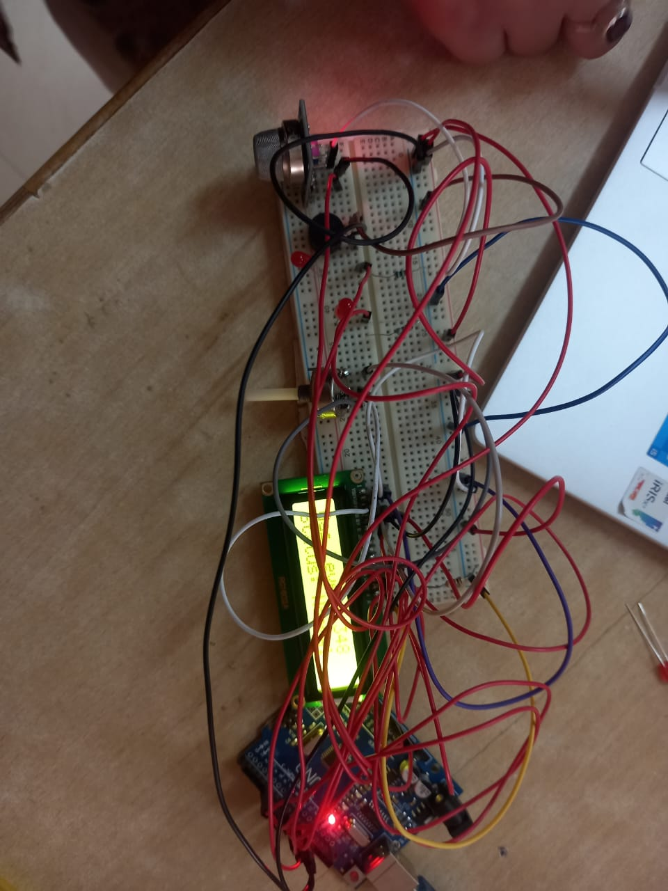

# Gas Leak and Alcohol Detection System using Arduino Uno and MQ-2 Sensor

*(Replace "your-image-file-name.jpg" with your actual image file name.)*

**Date:** Monday, March 17, 2025

---

## 🚀 Project Overview

This project is designed to detect gas leaks or the presence of alcohol using an MQ-2 gas sensor interfaced with an Arduino Uno microcontroller. It ensures safety through real-time monitoring and automated alerts using a buzzer (audible alert) and LED indicator (visual alert). The system is suitable for various applications including industrial safety, automotive safety systems, and personal safety devices.

---

## ✨ Features

- ✅ **Real-time Monitoring:** Continuous sensing of gas or alcohol presence.
- ✅ **Automated Alerts:** Immediate notification via LED and buzzer upon detecting hazardous levels.
- ✅ **LCD Display:** Clear display of gas levels and detection status on a 16x2 LCD.
- ✅ **Versatile Applications:** Ideal for industrial environments, vehicles, homes, and personal safety.

---

## 🛠️ Hardware Components Used

- Arduino Uno Microcontroller
- MQ-2 Gas Sensor
- 16x2 LCD Display
- LED Indicator
- Buzzer
- Breadboard and Jumper Wires

---

## 📌 Circuit Connections

| Component         | Arduino Pin        |
|-------------------|--------------------|
| MQ-2 Gas Sensor   | Analog Pin A0      |
| LED Indicator     | Digital Pin 13 (Built-in LED) |
| LCD RS            | Digital Pin 12     |
| LCD Enable        | Digital Pin 11     |
| LCD D4 - D7       | Digital Pins 4, 5, 6, 7 |
| Buzzer            | Connect as per your circuit design |

---

## 💻 Software Requirements

- [Arduino IDE](https://www.arduino.cc/en/software)

---

## ⚙️ Installation & Usage

1. **Clone or Download this Repository:**

2. **Open the Arduino IDE:**
- Navigate to the downloaded folder.
- Open the provided `alcohol_sensor_arduino.ino` file.

3. **Connect Hardware Components:**
- Follow the circuit diagram/connections mentioned above.

4. **Upload the Code:**
- Select Arduino Uno from the board menu.
- Choose the correct COM port.
- Click on "Upload" to upload the sketch onto your Arduino board.

5. **Run & Monitor:**
- After uploading, power on your system.
- Observe real-time gas values on the LCD display.
- Alerts will trigger automatically upon detection of hazardous levels.

---

## 📖 Code Explanation

The provided Arduino sketch (`alcohol_sensor_arduino.ino`) includes:

- Initialization of LCD display and MQ-2 sensor readings.
- Real-time analog readings from MQ-2 sensor displayed on LCD.
- Threshold-based detection logic for gas/alcohol presence.
- Activation of built-in LED indicator and buzzer alerts upon detection.

---

## 🚧 Future Enhancements

Possible improvements for future versions include:

- Integration with IoT platforms for remote monitoring.
- SMS/Email notifications for remote alerts.
- Data logging capability for historical analysis.

---

## 📸 Project Demonstration

*(Insert your project demonstration video or images here.)*

---

## 📜 License

This project is open-source and available under the MIT License. Feel free to modify and use it according to your needs.

